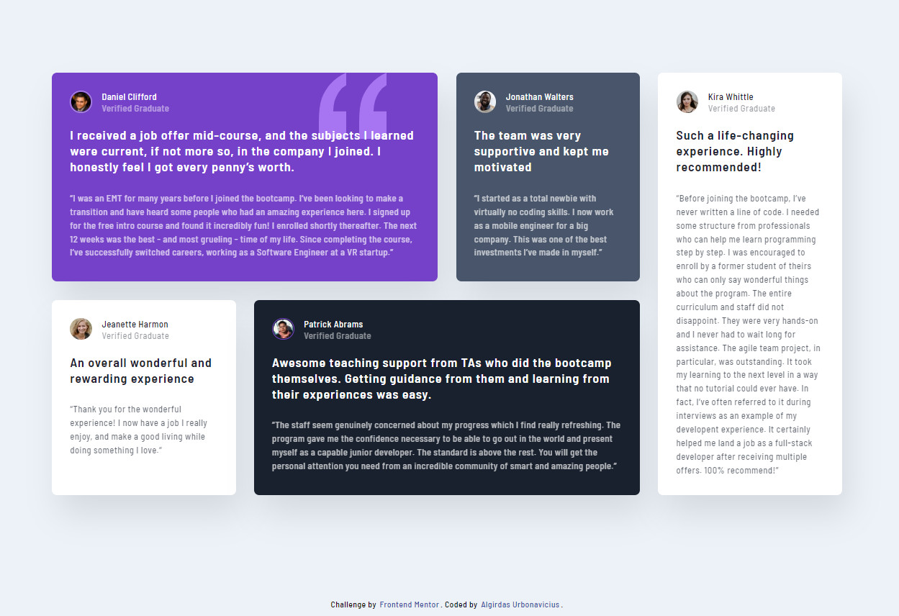
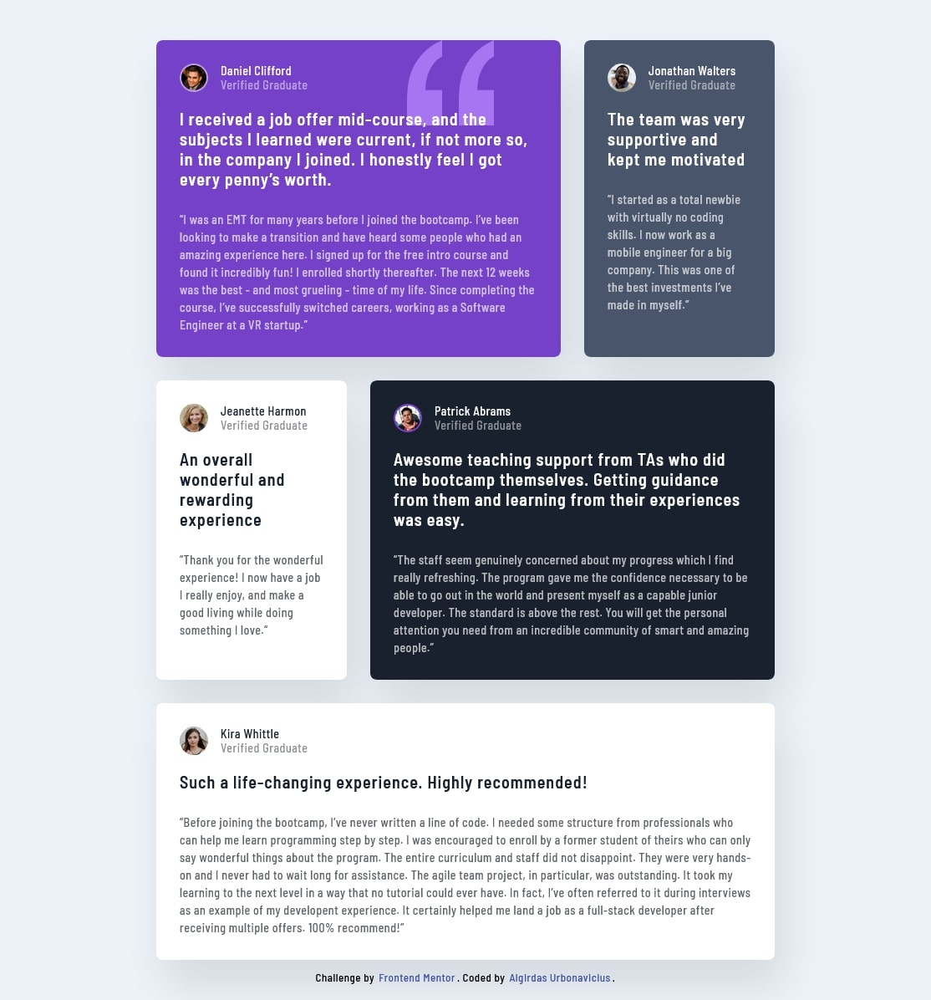

# Frontend Mentor - Testimonials grid section solution

This is a solution to the [Testimonials grid section challenge on Frontend Mentor](https://www.frontendmentor.io/challenges/testimonials-grid-section-Nnw6J7Un7). Frontend Mentor challenges help you improve your coding skills by building realistic projects. 

## Table of contents

- [Overview](#overview)
  - [The challenge](#the-challenge)
  - [Screenshot](#screenshot)
  - [Links](#links)
- [My process](#my-process)
  - [Built with](#built-with)
  - [What I learned](#what-i-learned)
  - [Author](#author)
- [Acknowledgments](#acknowledgments)

## Overview

### The challenge

Users should be able to:

- View the optimal layout for the site depending on their device's screen size

### Screenshot





### Links

- Solution URL: (https://your-solution-url.com) AAAAAAAAAAAAAAAAAAAAAAA
- Live Site URL: (https://your-live-site-url.com) AAAAAAAAAAAAAAAAAAAAAAAAAAA

## My process

### Built with

- Semantic HTML5 markup
- CSS custom properties
- Flexbox
- CSS Grid
- SCSS

### What I learned

How to use grid and simple hover effect.

How to center and simple hover effect:

```html
<body>
  <span>Hover</span>
</body>
```
```css
body {
  display: grid;
  height: 100vh;
  place-items: center;
}

span {
  font-size: 100px;
  color: grey;
  box-shadow: inset 0 0 0 0 lightgrey;
  transition: color 0.2s ease-in-out, box-shadow 0.2s ease-in-out;
 }

span:hover {
  box-shadow: inset 17rem 0 0 0 lightgrey;
}
```

## Author

- Website - [Add your name here](https://www.your-site.com)
- Frontend Mentor - [@yourusername](https://www.frontendmentor.io/profile/yourusername)
- Twitter - [@yourusername](https://www.twitter.com/yourusername)


